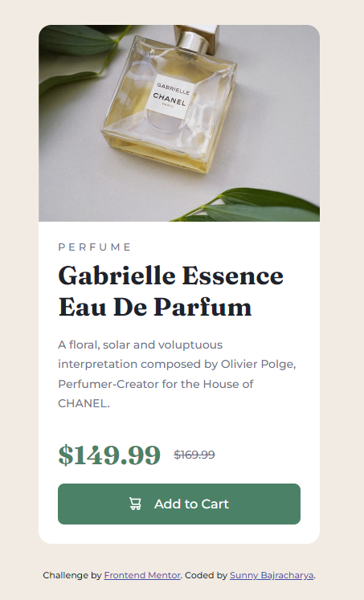

# Frontend Mentor - QR code component solution

This is a solution to the [QR code component challenge on Frontend Mentor](https://www.frontendmentor.io/challenges/product-preview-card-component-iux_sIO_H). Frontend Mentor challenges help you improve your coding skills by building realistic projects. 

## Table of contents

- [Overview](#overview)
  - [Screenshot](###screenshot)
  - [Links](#links)
- [My process](#my-process)
  - [Built with](#built-with)
  - [What I learned](#what-i-learned)
  - [Continued development](#continued-development)
  - [Useful resources](#useful-resources)
- [Author](#author)
- [Acknowledgments](#acknowledgments)

## Overview

### Screenshot



### Links

- Solution URL: (https://github.com/Dektret/Product-Preview-Card-Component)
- Live Site URL: (https://your-live-site-url.com)

## My process

### Built with

- Semantic HTML5 markup
- CSS custom properties
- Flexbox
- CSS Grid
- Mobile-first workflow

### What I learned

This project helped me to learn how to properly align two separate elements together as well as give them specific shape.

I also learnt how to use media queries to change the design according to the device types.

```css
@media (min-width:640px) {
    .container
    {
        display: grid;
        grid-template-columns: repeat(2,1fr);
        min-width: 600px;
    }
    .container article:first-child img {
        border-radius: 0.5rem 0 0 0.5rem;
        width: 100%;
    }
    .container article:last-child {
        border-radius: 0 0.5rem 0.5rem 0;
        width: 100%;
    }
    .container h2 {
        margin: -1rem 1rem 1rem 0.5rem;
    }
    .container h1 {
        padding: 0rem 3rem 0rem 0.5rem;
        line-height: 90%;
    }
    .container p {
        padding: 1.5rem 1rem 1rem 0.5rem;
    }
    .container ul li{
        padding:0.5rem 0 0 0.5rem;
    }
    .container .btn {
        margin: 1.5rem 0 -1.5rem 0.5rem;
        max-width: 95%;
    }    
    .container ul li:last-child{
    margin-top: -0.1rem;
    }
}
```

### Continued development

Currently, I am a beginner in frontend web development. I started learning html and css just to develop additional skills. Now, that i have experienced desinging webpages and also knowing the fact that there is more to web designing than just html and css i started to have fun messing with webpages. I found myself consuming more and more content of web development over the internet and even though i understood nothing it was fun to watch and see people creating webpages out of nothing but just code. I am on a journey to learn frontend web development and then to become a full stack developer soon! 

### Useful resources

- (https://www.youtube.com/watch?v=BMOH4zSLTnQ) - This helped me for when i was stuck on how i could change the height and width of the image and article so that I could perfectly align them together. I really liked this pattern and will use it going forward.
- (https://www.w3schools.com/css/css3_mediaqueries.asp) - This is an amazing article which helped me finally understand when to use media queries and also how to use them. I'd recommend it to anyone still learning this concept.

## Author

- Frontend Mentor - [@Sunny](https://www.frontendmentor.io/profile/Dektret)
- Twitter - [@DiabloKek](https://twitter.com/sunnybaj2)

## Acknowledgments

-tsbsankara on youtube.

Hats off to tsbsankara. I really like how he deals with designing the web pages and also how he tackles problems.
